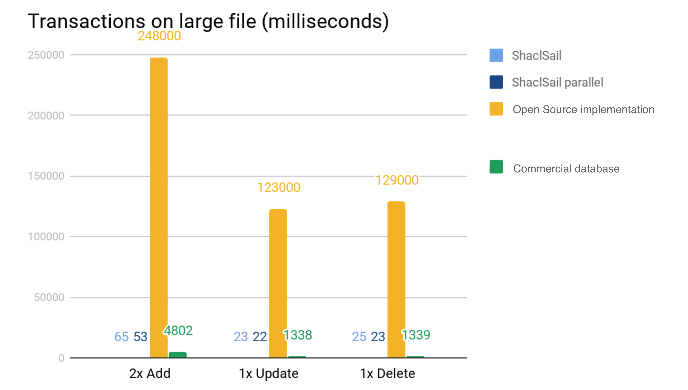

Semantic Web Technologies is a set of very powerful tools and technologies for working 
with Linked Open Data, Graph databases, vocabularies, ontologies and much more.

Users of semantic tech far too often hit upon performance issues when developing systems and tools. 
This is where I can help.

## Skills
 
- Best practices when using Apache Jena or Eclipse RDF4J (Sesame)
- Performance tuning of SPARQL queries  
- Java 6, 7, 8, 9 and 11
- Java performance
- Fast reasoning
- Fast SHACL validation
- Triple stores in production

## Who am I?
My name is Håvard M. Ottestad. I have a Masters in Computer Science with a focus on Networks, 
Distributed Systems and Semantic Web Technologies. I have more than 5 years of experience with
developing and running systems based on semantic tech. Most of those spent trying to make things
faster and better.    

## How to get in touch

If you want to hire me to help out on your semantic tech project you can get in touch with me through
- Email to hmottestad (at) gmail (dot) com
- [LinkedIn](https://www.linkedin.com/in/håvard-ottestad-a825a2127/)

## My high performance contributions

- [2x to 80x faster RDFS reasoning for Ecplise RDF4J](http://docs.rdf4j.org/javadoc/latest/org/eclipse/rdf4j/sail/inferencer/fc/SchemaCachingRDFSInferencer.html)
- [Incremental SHACL engine for Eclipse RDF4J](http://docs.rdf4j.org/programming/#_validation_with_shacl)
- [1.8x to 6500x faster SPIN support in Eclipse RDF4J](http://docs.rdf4j.org/javadoc/latest/org/eclipse/rdf4j/sail/spin/SpinSail.html)  
- [XmlToRDF - Streaming XML to RDF converter that handles 100 MB of XML in ~2 seconds](https://github.com/AcandoNorway/XmlToRdf)

## Projects backed by Semantic Web I have woked on
- [eInnsyn - a solution for transparency in the public sector](https://einnsyn.no)
- [Felles datakatalog - a DCAT portal for Norway](https://fellesdatakatalog.brreg.no)
- [POSC Caesar Association RDL - A linked-open-data solution for reference data](http://data.posccaesar.org/rdl/)
- [ILAP - Exchange of planning data based on ontologies and linked data](https://ilap.org)
- [A DCAT validator in Javascript](https://difi.github.io/dcat-ap-no-validator/)
 
 
## Incremental SHACL Engine
Data validation for RDF, JSON-LD and Turtle has always been challenging. Solutions based on SPIN 
are usually both hard to develop and needlessly slow. SHACL simplifies data validation with a clean 
and easy to use vocabulary for describing restrictions on your data.

There are many SHACL engines to choose from, both open source and commercial. However, these 
engines are all slow in the face of changing data. Essentially they are all built for validating your data
all at once, so any changes you make require them to revalidate your entire dataset.

Eclipse RDF4J ShaclSail supports in-memory and on disk databases. Any changes applied to your 
database gets analyzed by the ShaclSail so the validation is fast and efficient. How fast you say? 
Around 50x faster than a commercial implementation and >1000x faster than a free open source 
implementation.

